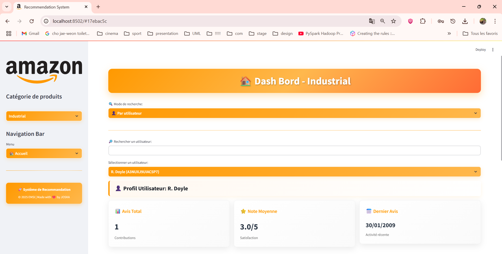
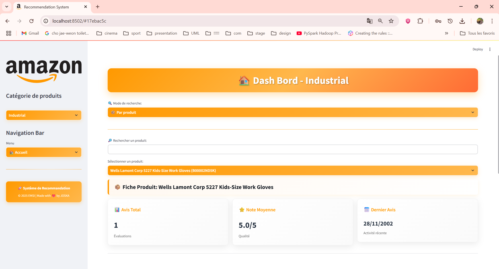
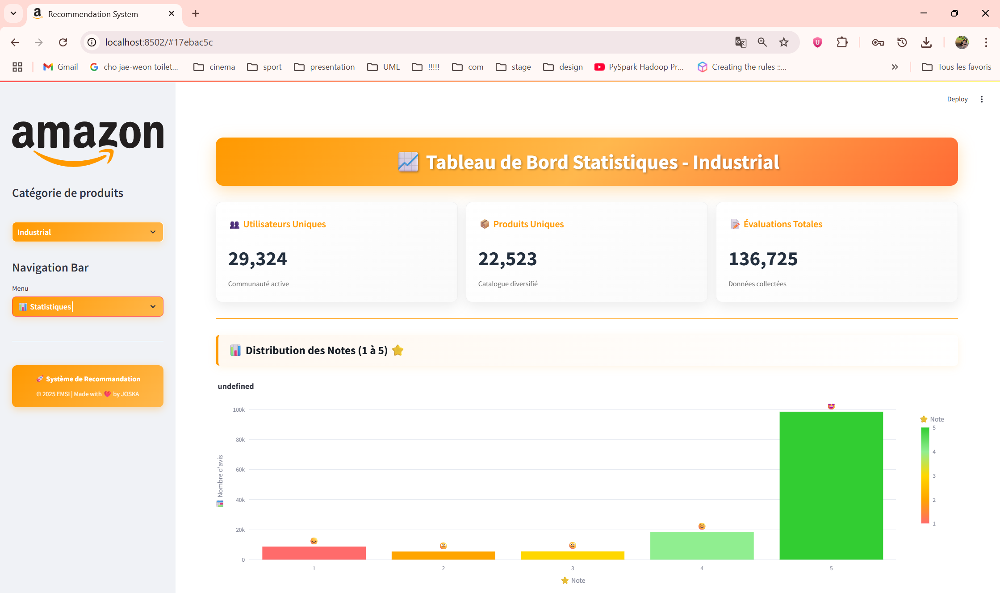
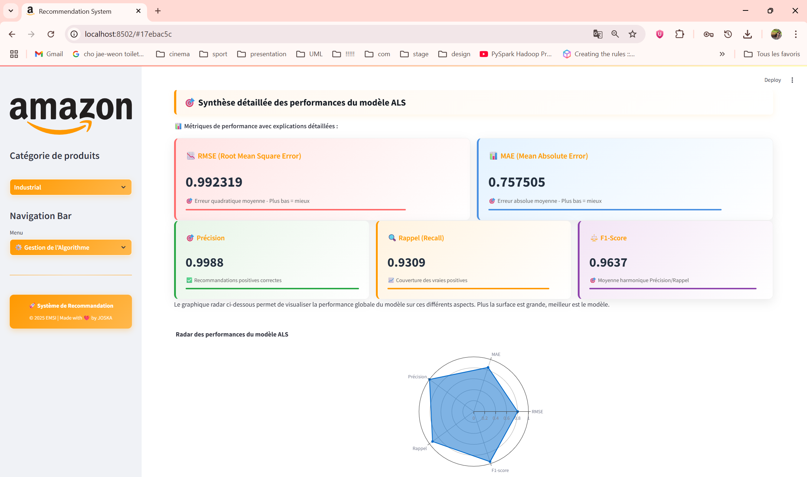
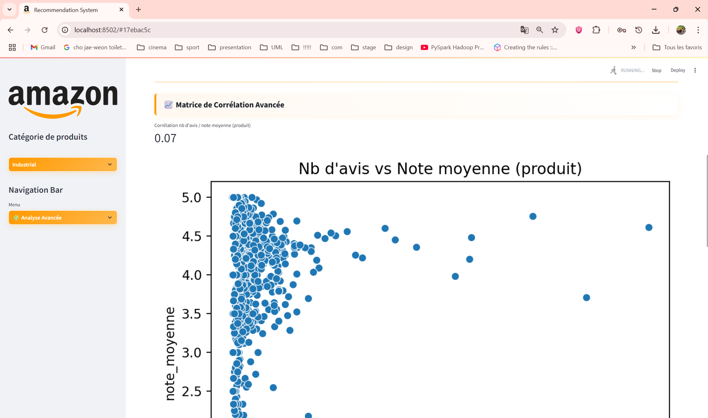

# Dashboard de Recommandation Amazon (Catégorie Industrielle)

## 📝 Présentation du projet
Ce projet propose une application web interactive permettant d’explorer, d’analyser et de recommander des produits Amazon dans la catégorie « Industrial & Scientific ». L’interface permet de visualiser les avis, les statistiques, d’obtenir des recommandations personnalisées et d’analyser les performances du modèle de recommandation (ALS).

## 🎯 Fonctionnalités principales
- Recherche et exploration des produits et utilisateurs
- Visualisation détaillée des avis et statistiques
- Recommandations personnalisées via un modèle ALS (PySpark)
- Statistiques globales et avancées (heatmap, corrélations)
- Export des données et résultats

## 🗃️ Jeux de données utilisés

Le projet s’appuie principalement sur la base de données Amazon « Industrial & Scientific » pour l’analyse, la visualisation et la recommandation de produits industriels. 
Pour tester la robustesse et la généralisation de l’algorithme de recommandation (ALS), des jeux de données issus de la catégorie « Électronique » d’Amazon ont également été utilisés lors de la phase de test et de validation.


## 🖼️ Aperçu de l’interface

<div align="center">

[]
[]

[]
[]

[]

</div>


## 🛠️ Outils et technologies utilisés
- **Python 3.8+**
- **Streamlit** (interface web)
- **PySpark** (traitement et modèle ALS)
- **Pandas, NumPy** (manipulation de données)
- **Plotly, Seaborn, Matplotlib** (visualisation)
- **scikit-learn** (métriques)

## ⚙️ Prérequis et installation
1. **Cloner le projet**
   ```bash
   git clone <url-du-repo>
   cd <nom-du-dossier>
   ```
2. **Installer les dépendances**
   - Avec pip :
     ```bash
     pip install -r requirements.txt
     ```
   - Ou via Docker (optionnel) :
     ```bash
     docker build -t amazon-dashboard .
     docker run -p 8501:8501 amazon-dashboard
     ```
3. **Vérifier que Java est installé** (pour PySpark)
   - [Télécharger Java](https://www.oracle.com/java/technologies/downloads/)

    ```bash
     java -version
     ```

## 🚀 Lancer l’application
1. **Activer l’environnement virtuel** (Windows : PowerShell)
   ```powershell
   .\Venv\Scripts\activate
   ```
2. **Lancer l’application Streamlit**
   ```bash
   streamlit run streamlit/app.py
   ```

## 📂 Structure du projet
- `streamlit/app.py` : application principale
- `data/` : jeux de données (raw, processed)
- `src/` : scripts de prétraitement
- `images/` : captures d’écran
- `requirements.txt` : dépendances Python

